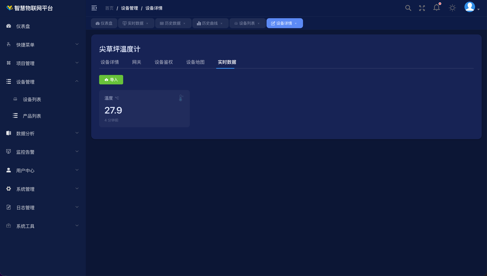
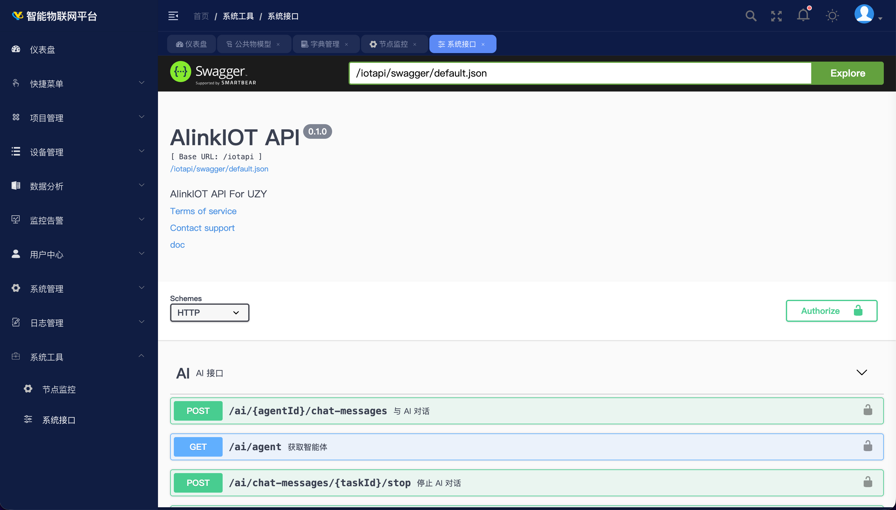

# 快速开始

> 本章帮助你在最短时间内登录平台、熟悉导航，并完成第一台设备的接入。更深入的操作与接口对接请参阅后续章节。

## 登录平台


1. 打开浏览器，访问平台地址
2. 选择登录方式：
   - **账号登录**：输入账号和密码，勾选“记住密码”可保存登录状态
   - **手机登录**：输入手机号，获取验证码登录
   - **微信登录**：点击“微信登录”，扫码授权
3. 点击**登录**按钮进入平台

> 首次登录请联系管理员获取账号，或点击**立即注册**自行注册。

## 平台导航说明

登录后进入仪表盘，左侧为主导航菜单，顶部支持全屏、通知、设置等快捷操作。

| 菜单项 | 功能 |
|--------|------|
| 仪表盘 | 全局设备状态大盘 |
| 快捷菜单 | 个人自定义常用入口 |
| 项目管理 | 项目列表、场景列表、应用接入 |
| 设备管理 | 设备列表、产品列表 |
| 数据分析 | 实时数据、历史数据、历史曲线 |
| 监控告警 | 历史告警、告警规则、群组管理 |
| 用户中心 | 用户管理、角色管理、权限管理 |
| 系统管理 | 公共物模型、协议管理、菜单管理、字典管理 |
| 日志管理 | 操作日志、登录日志、设备日志 |
| 系统工具 | 节点监控、系统接口 |

## 快速上手路径（5 步接入设备）

```
第1步：创建产品  →  第2步：添加设备  →  第3步：创建项目/场景
     →  第4步：配置告警规则  →  第5步：查看数据
```

### 第 1 步：创建产品

进入 **设备管理 → 产品列表**，点击**新增**，填写产品名称、选择设备类型（直联 / 网关 / 子设备）、产品分类和协议标识（如 `mqtt-json`、`modbus-rtu`），保存。

产品是设备的模板，定义了一类设备使用的协议和数据格式（物模型）。

### 第 2 步：添加设备

进入 **设备管理 → 设备列表**，点击**新增**，填写设备地址、设备名称，选择所属产品，保存。设备创建后系统自动分配接入凭证。

在设备详情的**设备鉴权**标签页，可查看该设备的 MQTT / TCP 接入凭证与完整 Topic 列表，一键复制即可用于设备端对接。


### 第 3 步：创建项目和场景

进入 **项目管理 → 项目列表**，点击**新增**创建项目；再进入**场景列表**，在项目下新增场景，将设备加入场景完成分组。


- **项目**：顶层业务单元，可配置独立访问域名、行业分类
- **场景**：将一批设备归为一组，支持设备列表 / 全景视图 / 场景地图 / 3D 视图四种浏览方式

### 第 4 步：配置告警规则

进入 **监控告警 → 告警规则**，点击**新增**，设置触发条件、告警等级和通知渠道（站内 / 短信 / 公众号 / 第三方应用），保存后立即生效，无需重启服务。

### 第 5 步：查看数据

进入 **数据分析 → 实时数据**，选择产品和设备，即可看到设备最新上报数据。历史数据与历史曲线可在对应菜单按时间范围、聚合粒度查询并导出。



## 下一步

- **部署平台**：参见 [安装部署](deployment/installation.md)
- **设备接入对接**：参见 [设备接入](api/device.md)
- **应用 / 第三方系统对接**：参见 [应用接入](api/app.md)
- **常见问题**：参见 [常见问题](FAQ.md)

平台内置 Swagger UI（**系统工具 → 系统接口**），可在线查阅与调试全部开放接口：


