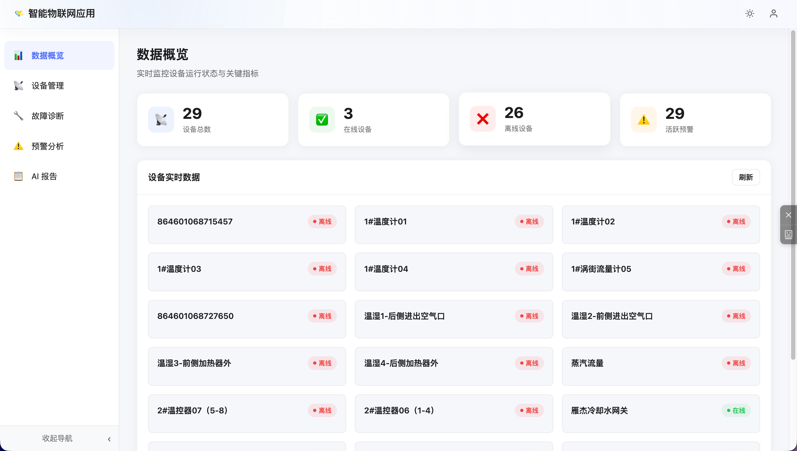
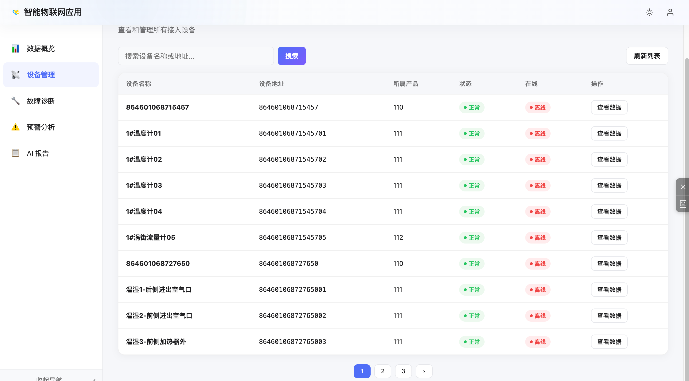
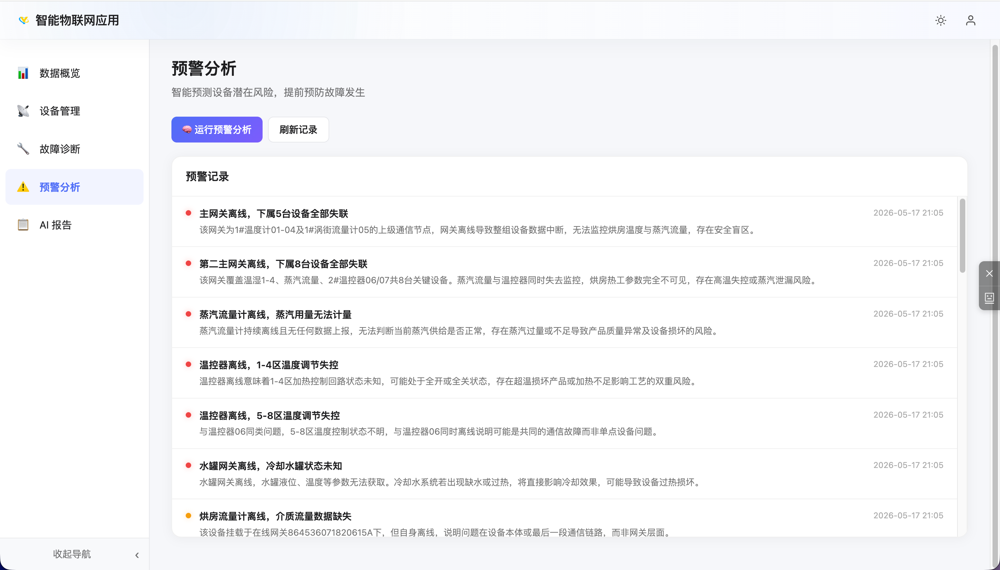
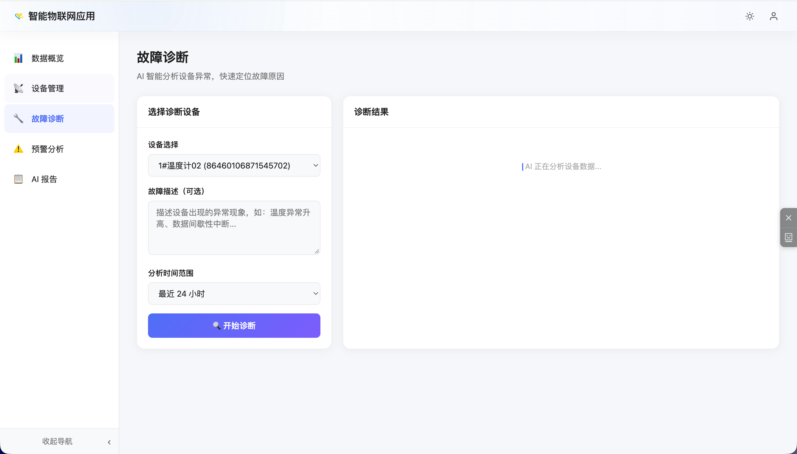
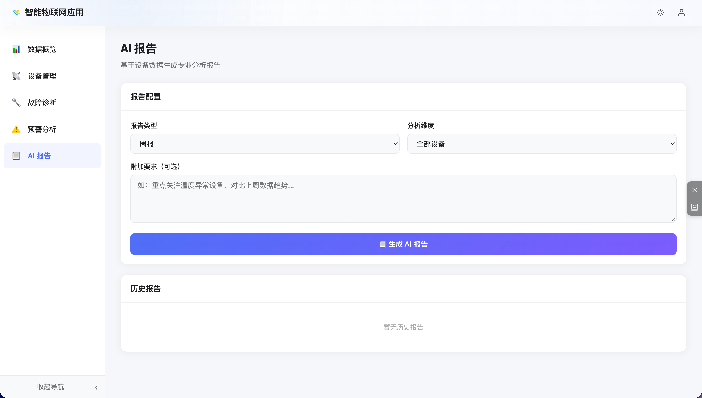

# 设备故障智能运维

## 方案背景

传统工业设备运维依赖人工巡检和事后报修，故障发现滞后、处理效率低、维护成本高。随着 AI 大模型能力的普及，越来越多的企业希望将设备运行数据与 AI 能力结合，实现从“事后维修”到“主动预防”的运维模式转变。

alinkiot 平台通过开放的 REST API 和 MQTT 实时数据通道，为第三方智能运维应用提供完整的数据底座，支撑 AI 预警、智能诊断、自动报告等核心能力。

## 方案架构

```
┌─────────────────────────────────────────────────────────┐
│                   现场设备层                              │
│  传感器 / PLC / DTU / 振弦采集仪 / 倾角仪 / 流量计 …      │
└──────────────────────┬──────────────────────────────────┘
                       │  MQTT / TCP / Modbus
┌──────────────────────▼──────────────────────────────────┐
│                 alinkiot 物联网平台                        │
│  设备接入 · 实时数据 · 历史数据 · 告警规则 · 开放 API       │
└───────────┬──────────────────────┬──────────────────────┘
            │  REST API / MQTT      │  Webhook / 告警推送
┌───────────▼──────────┐  ┌────────▼──────────────────────┐
│   智能运维应用         │  │   通知渠道                     │
│  · AI 健康评估引擎     │  │   微信 / 短信 / 邮件 / 钉钉    │
│  · 故障预警模型        │  └────────────────────────────── ┘
│  · 根因诊断分析        │
│  · AI 运维报告生成     │
│  · 工单派发系统        │
└──────────────────────┘
```

## 核心能力

### 1. 实时数据接入

智能运维应用通过平台 **MQTT 订阅**或 **REST API 轮询**获取设备实时数据：

- 订阅 `p/out/{addr}` 接收设备上行数据，延迟 < 1 秒
- 调用 `/iotapi/system/device/history/last` 获取设备最新采集值
- 调用 `/iotapi/system/history/list` 拉取任意时间段历史数据，用于趋势分析



*实时展示设备总数、在线/离线设备数、活跃预警数，设备实时数据卡片一览无余，支持一键刷新*

### 2. 设备统一管理

基于平台开放 API，运维应用可拉取全量设备列表，展示设备地址、所属产品、运行状态、在线状态，支持按名称/地址搜索，一键查看设备历史数据。



*列表展示设备名称、地址、所属产品、运行状态（正常/异常）、在线状态，点击「查看数据」直接跳转该设备数据详情*

### 3. AI 故障预警

基于设备历史数据训练异常检测模型，结合平台告警规则实现多层预警：

| 预警层级 | 触发方式 | 说明 |
|---------|---------|------|
| **规则预警** | 平台告警规则 | 阈值触发，毫秒级响应，适合明确边界的故障（如温度超限、断电） |
| **趋势预警** | AI 模型分析 | 检测数据趋势异常（如振动值缓慢上升），提前数小时/天预警 |
| **关联预警** | 多设备联合分析 | 跨设备数据关联，识别系统性故障苗头（如主网关离线导致下属多台设备失联） |



*AI 扫描全量设备数据，自动生成带风险说明的预警记录，每条预警包含故障影响范围与潜在风险描述，帮助运维人员在故障扩大前主动介入*

### 4. 智能故障诊断

设备触发告警后，AI 引擎自动执行诊断流程：

```
1. 拉取故障设备近 N 天历史数据
2. 与同类设备正常基线对比
3. 调用 AI 大模型（GPT / 文心 / 通义等）分析根因
4. 输出故障可能原因列表 + 置信度排序
5. 匹配历史同类故障处理方案，推荐处置步骤
```



*选择目标设备、填写故障描述（可选）、设置分析时间范围，点击「开始诊断」，AI 实时分析设备数据并在右侧输出诊断结论与处置建议*

### 5. AI 运维报告自动生成

定时或按需触发报告生成，支持日报/周报/月报，可按全部设备或指定设备维度出具报告，内容包括：

- **设备健康评分**：基于运行时长、故障频次、数据异常率综合评估
- **故障统计分析**：时间段内故障次数、类型分布、平均修复时长
- **趋势预测**：基于历史数据预测未来 7/30 天风险设备清单
- **维保建议**：结合设备寿命模型，输出预防性保养建议
- **运维效率报告**：工单响应时长、处理率、重复故障率等 KPI



*选择报告类型（日报/周报/月报）、分析维度、附加要求，一键生成专业分析报告，历史报告归档可随时查阅*

报告格式支持 PDF / Word / HTML，可通过微信、短信、邮件自动推送给负责人。

### 6. 工单与派工联动

AI 判断需要人工介入时，自动创建运维工单：

- 推送告警详情、诊断结论、建议处置方案至工单系统
- 通过平台消息通道（微信公众号 / 短信）通知对应运维人员
- 工单处理结果回写平台，形成完整运维记录闭环

## 对接方式

智能运维应用通过以下方式与 alinkiot 平台集成：

**第一步：创建应用凭证**

在平台「项目管理 → 应用接入」创建应用，获取 `appId` 和 `Secret`。

**第二步：获取 Token**

```bash
POST /iotapi/system/user/app/login
{
  "appId": "your_app_id",
  "secret": "your_secret"
}
# 返回 token、projectId、expire
```

**第三步：数据拉取**

```bash
# 获取设备实时数据
GET /iotapi/system/device/history/last?productId=xxx&deviceAddr=xxx

# 获取历史数据（用于 AI 分析）
GET /iotapi/system/history/list?deviceAddr=xxx&startTime=xxx&endTime=xxx
```

**第四步：MQTT 实时订阅**

```
# 订阅设备上行数据（实时推送，延迟 < 1s）
Topic: p/out/{addr}

# 订阅平台控制指令
Topic: p/in
```

> 完整接口说明参见 [应用接入](../api/app.md)。

## 方案价值

| 维度 | 传统运维 | AI 智能运维 |
|------|---------|-----------|
| **故障发现** | 人工巡检 / 用户报修，滞后数小时 | 实时监测 + AI 预警，提前感知 |
| **故障诊断** | 依赖老师傅经验，耗时长 | AI 秒级输出诊断报告，推荐处置方案 |
| **运维报告** | 人工整理，周期长，易出错 | 自动生成，定时推送，数据准确 |
| **维保计划** | 按固定周期被动保养 | 基于状态预测，按需主动保养 |
| **知识沉淀** | 依赖个人经验，难以传承 | 历史案例结构化沉淀，持续优化模型 |

> alinkiot 平台提供完整的数据底座与开放 API，智能运维应用专注 AI 模型与业务逻辑，双方通过标准接口解耦协作，快速落地交付。
